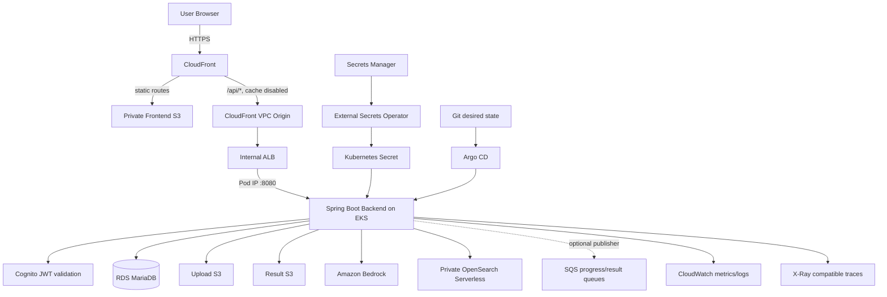
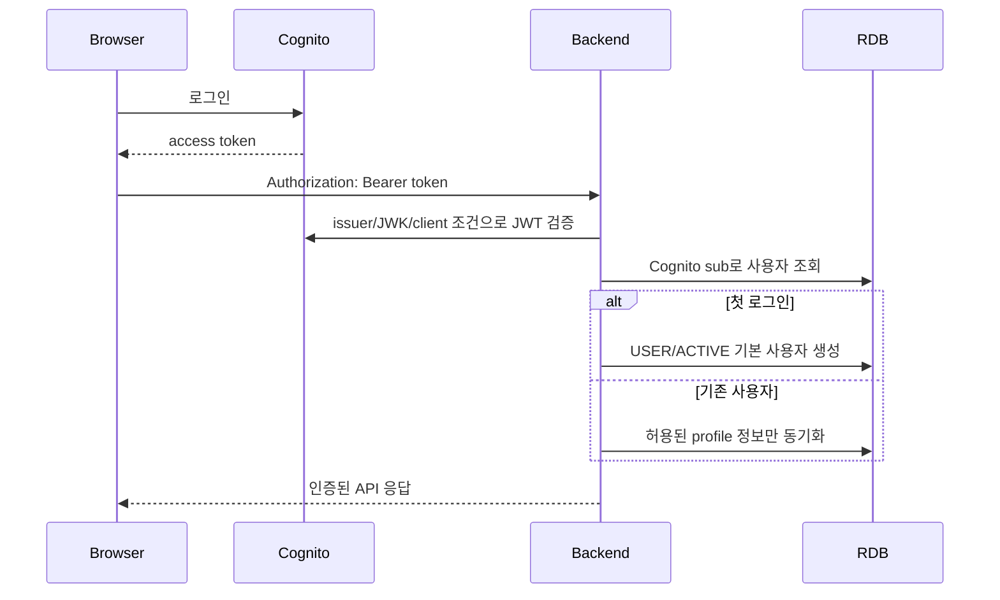
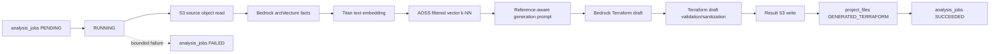
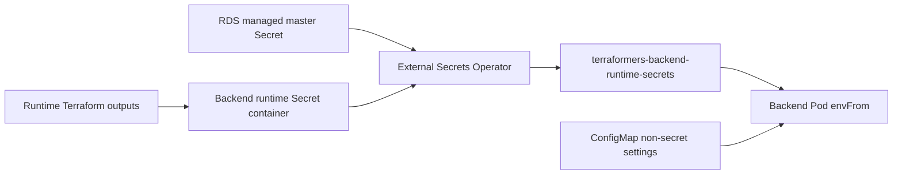
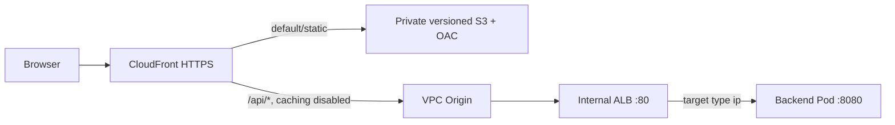
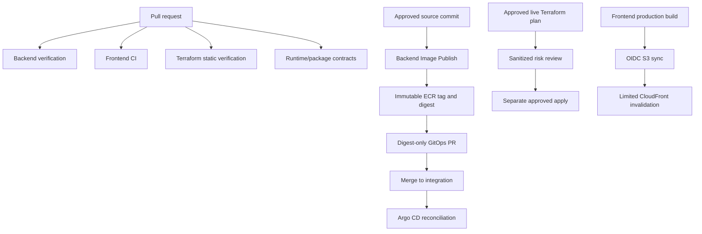

# Terraformers Modernization 프로젝트 전체 구성 안내서

Status: canonical technical overview of the last verified deployed architecture; runtime teardown is verified, bootstrap closure is pending

## 1. 이 문서를 먼저 읽는 이유

이 문서는 Terraformers-modernization 저장소를 처음 보는 사람이 Java, Terraform, Kubernetes, GitHub Actions 코드를 파일별로 직접 추적하지 않아도 다음을 이해할 수 있도록 작성한 최상위 안내서다.

- 사용자가 이용하는 기능
- 서비스 요청이 어떤 구성요소를 통과하는지
- Backend, RDB, S3, Cognito, Bedrock, AOSS가 각각 무엇을 책임지는지
- Terraform state가 왜 여러 단계로 분리되어 있는지
- Kubernetes, External Secrets, AWS Load Balancer Controller, Argo CD가 각각 무엇을 관리하는지
- 이미지 빌드부터 실제 Pod 반영까지 어떤 변경 흐름을 사용하는지
- 관측성은 무엇을 수집하고 어떤 민감 정보는 제외하는지
- 프로젝트 수행 중 수많은 변경 가운데 무엇이 중요한 설계 결정인지
- 구현 완료, 라이브 검증 완료, 문서화만 완료, 의도적으로 제외한 범위를 어떻게 구분하는지

세부 코드나 장애 기록이 필요할 때만 각 절에 연결된 파일을 추가로 읽는다.

### 현재 lifecycle claim boundary

이 문서는 현재 실행 중인 서비스의 상태판이 아니라 **마지막으로 검증된 배포 아키텍처와 저장소 구현의 canonical 전체 안내**다. Runtime teardown은 read-only closure run `29904386655`로 검증되었으며, 여섯 runtime Terraform state와 exact active runtime AWS resource count는 모두 0이다. Bootstrap inventory는 통과했지만 bootstrap deletion은 승인·실행되지 않았고 zero-resource proof도 완료되지 않았다.

- 2024년 팀 프로젝트의 기능 구현과 이후 개인 고도화의 재사용·운영 정렬을 구분한다.
- 실제 구현 및 historical live verification은 증빙 문서가 뒷받침하는 범위에서만 주장한다.
- Terraform root, workflow, manifest, runbook은 teardown 뒤 재구축 가능한 범위를 설명하지만, 실제 redeployment 완료를 뜻하지 않는다.
- 현재 workload, 실행 중 CloudFront URL, bootstrap 완전 삭제, account-wide zero-resource proof는 주장하지 않는다.

현재 종료 상태는 [current operations plan](current-operations-delivery-plan.md), runtime 결과는 [runtime closure](lifecycle/aws-runtime-teardown-closure.md), 재구축 절차는 [redeploy runbook](lifecycle/aws-redeploy-runbook.md)를 따른다.

## 2. 문서 우선순위

프로젝트 문서가 서로 다른 시점에 작성되어 일부 오래된 설명이 남아 있다. 충돌 시 다음 순서를 따른다.

1. `docs/current-operations-delivery-plan.md` — 현재 종료 작업 순서와 변경 금지 범위
2. 이 문서 — 현재 시스템 구성과 주요 설계 결정
3. 실제 integration branch 코드와 라이브 증거
4. 영역별 세부 문서
5. 과거 roadmap과 초기 README 설명

특히 초기 README에 남아 있는 “Python analysis service가 기본 분석 runtime” 설명은 현재 구조와 다르다. 현재 기본 runtime은 **Spring Boot 통합 분석 방식**이며 Python 서비스는 과거 구현 참고 자료다.

## 3. 프로젝트 정체성

### 3.1 출발점

Terraformers는 2024년 AWS Cloud School 5인 팀 프로젝트다. 사용자가 AWS 아키텍처 이미지를 업로드하면 AI가 구성요소를 분석하고 Terraform 코드 초안을 생성하며, 프로젝트·파일·결과·댓글 등을 웹에서 관리하는 서비스였다.

### 3.2 고도화 목표

후속 작업의 목표는 동일 서비스를 새로 만드는 것이 아니었다. 기존 팀 산출물과 `siamese-lang/rdb-refactor`를 재사용하면서 다음 운영 문제를 해결하는 것이었다.

- 충돌하던 프로젝트/RDB 도메인 통합
- 인증 사용자와 데이터 소유권 연결
- S3 객체와 RDB 메타데이터의 책임 분리
- 분석 job 상태와 실패 원인 관리
- Bedrock/AOSS 연동을 Spring Boot 안으로 통합
- 실제 AWS 인프라의 Terraform state 분리와 승인형 적용
- Secret 값의 코드·manifest 분리
- immutable image와 Git desired state 일치
- CloudFront-only 공개 경로와 private Backend origin
- 로그·메트릭·트레이스 기반 장애 진단
- 전체 환경 철거와 재배포 가능성 문서화

### 3.3 이 프로젝트가 아닌 것

- Terraform 코드를 자동으로 검증하고 apply하는 제품
- 생성 AI 모델 품질 연구 프로젝트
- 새로 만든 개인 SaaS 서비스
- Kubernetes 고가용성 또는 autoscaling 실증 프로젝트
- Python 분석 서비스 현대화 프로젝트
- Grafana나 Prometheus 운영 자체를 보여 주는 모니터링 프로젝트

## 4. 사용자가 보는 기능

| 기능 | 설명 | 인증 |
|---|---|---|
| 회원가입·로그인 | Cognito를 이용해 세션과 token을 확보 | 공개 진입 |
| 공개 프로젝트 조회 | 공개 전환된 프로젝트와 Terraform 초안, 댓글 조회 | 일부 공개 |
| 새 코드 생성 | 프로젝트 이름과 아키텍처 이미지를 업로드해 분석 시작 | 필요 |
| 내 프로젝트 목록 | 현재 로그인 사용자가 소유한 활성 프로젝트 조회 | 필요 |
| 프로젝트 상세 | 원본 이미지, 파일 tree, 분석 상태, Terraform 초안 조회 | 소유자 또는 공개 범위 |
| 공개/비공개 전환 | 소유자 또는 관리자가 visibility 변경 | 필요 |
| Terraform 초안 편집 | canonical `terraform/main.tf` artifact 내용 수정 | 소유자 또는 관리자 |
| 댓글 | 공개 프로젝트 board를 통해 댓글 작성·조회 | 작성은 필요 |
| 프로젝트 삭제 | 프로젝트를 즉시 물리 삭제하지 않고 soft-delete | 소유자 또는 관리자 |

Frontend의 대표 경로는 다음과 같다.

```text
/login
/confirm-sign-up
/community
/generate
/projects
/projects/{projectId}
```

Frontend는 핵심 기술 기여로 과장하지 않는다. Backend API와 실제 사용자 흐름을 검증하는 client surface다.

## 5. 전체 아키텍처



핵심 보안 경계는 다음과 같다.

- 외부 사용자는 CloudFront만 접근한다.
- Backend ALB는 internet-facing이 아닌 `internal`이다.
- Backend Service는 `ClusterIP`다.
- CloudFront는 VPC origin을 통해 internal ALB로 접근한다.
- AOSS collection은 public access를 허용하지 않고 VPC endpoint로만 접근한다.
- EKS workload는 static AWS key가 아니라 IRSA를 사용한다.
- Secret 값은 Git, ConfigMap, 공개 artifact에 저장하지 않는다.

## 6. 주요 요청 흐름

### 6.1 로그인과 사용자 매핑



중요한 결정:

- 사용자 식별자는 email이 아니라 Cognito access token의 `sub`다.
- email은 변경 가능하므로 고유 인증 식별자로 사용하지 않는다.
- request body의 userEmail로 작성자를 지정하지 않는다.
- 동시 첫 로그인 시 unique constraint 충돌을 재조회 방식으로 처리한다.
- Cognito fallback username이 사용자가 저장한 nickname을 덮어쓰지 않게 한다.

주요 코드:

```text
backend/src/main/java/com/terraformers/modernization/security/CognitoJwtSecurityConfig.java
backend/src/main/java/com/terraformers/modernization/identity/AuthenticatedUserService.java
backend/src/main/java/com/terraformers/modernization/identity/UserEntity.java
```

### 6.2 이미지 업로드와 프로젝트 생성

```text
1. 인증 사용자 확인
2. numeric BIGINT project 생성
3. 원본 architecture image를 storage boundary로 저장
4. project_files에 ARCHITECTURE_IMAGE metadata 등록
5. analysis_jobs row 생성
6. 비동기 executor에 job 제출
7. frontend는 project detail로 이동해 상태 polling
```

클라이언트 파일명, S3 key, correlation ID를 project primary key로 사용하지 않는다. 프로젝트의 canonical identity는 RDB의 숫자 ID다.

주요 코드:

```text
analysis/AnalysisUploadController.java
analysis/AnalysisUploadService.java
projectcore/ProjectDomainService.java
projectcore/ProjectFileEntity.java
```

### 6.3 통합 분석 pipeline



현재 기본 분석 구현은 Backend 내부 Java 코드다.

```text
AnalysisJobRunner
  -> AnalysisJobOrchestrator
     -> AnalysisProvider
        -> BedrockRuntimeAnalysisProvider / BedrockAnalysisProvider
           -> BedrockArchitectureFactsExtractor
           -> BedrockEmbeddingProvider
           -> RetrievalModeReferenceRetriever
              -> OpenSearchReferenceRetriever
                 -> SignedOpenSearchHttpClient
           -> BedrockPromptBuilder
           -> BedrockResponseParser
     -> TerraformDraftValidator
     -> AnalysisResultStorage
     -> ProjectArtifactService
```

중요한 처리 원칙:

- 분석 시작·성공·실패 상태를 `analysis_jobs`에 기록한다.
- AI response나 adapter exception을 사용자에게 그대로 노출하지 않는다.
- timeout, output truncation, response format, architecture input rejection을 구분해 안전한 실패 문구를 저장한다.
- 생성된 Terraform은 syntax와 위험한 출력 형태를 검사한 뒤 저장한다.
- 성공 결과는 S3 object와 `project_files` artifact를 함께 생성한다.
- 새 결과가 생성되면 이전 generated Terraform artifact는 soft-delete된다.
- 생성 Terraform은 검토 가능한 초안이며 자동 apply하지 않는다.

### 6.4 조회와 협업

```text
projects
  -> project_files
  -> analysis_jobs
  -> terraform_runs
  -> boards
       -> comments
       -> board_reactions
```

- 소유 프로젝트는 owner ID와 `deleted_at IS NULL`로 조회한다.
- 공개 프로젝트는 visibility와 soft-delete 상태로 조회한다.
- private project는 owner 또는 ADMIN만 접근한다.
- `terraform/main.tf`는 일반 project column이 아니라 generated project file artifact다.
- 댓글은 `project -> board -> comment -> user` 관계를 사용한다.

## 7. Backend 내부 구조

### 7.1 package별 책임

| Package | 책임 | 핵심 클래스 |
|---|---|---|
| `identity` | Cognito subject 기반 사용자 생성·동기화·profile | `AuthenticatedUserService`, `UserEntity` |
| `security` | JWT resource-server 설정과 공개/보호 API 경계 | `CognitoJwtSecurityConfig` |
| `projectcore` | canonical project와 file domain, 권한, soft-delete | `ProjectDomainService`, `OwnedProjectEntity`, `ProjectFileEntity` |
| `project` | metadata, public project, Terraform draft API adapter | `ProjectMetadataController`, `TerraformDraftController` |
| `projecttree` | 파일 계층을 API tree로 조립 | `ProjectTreeService` |
| `projectcomment` | 기존 frontend endpoint와 canonical board/comment domain 연결 | `ProjectCommentService` |
| `collaboration` | board/comment/reaction persistence | entity/repository classes |
| `analysis` | job 생성, executor, 상태, orchestration, result storage | `AnalysisJobRunner`, `AnalysisJobOrchestrator` |
| `analysis.bedrock` | Bedrock request, prompt, response parse, bounded retry/failure | `BedrockAnalysisProvider` |
| `reference` | facts, embedding, retrieval policy와 reference model | `RetrievalModeReferenceRetriever` |
| `reference.opensearch` | k-NN request, response parse, SigV4 HTTP | `SignedOpenSearchHttpClient` |
| `storage` | source object read와 storage adapter API | `SourceObjectReaderService` |
| `config` | 필수 환경변수와 adapter 조합 검증 | `RuntimeAdapterContractValidator` |

### 7.2 기술 기준

| 항목 | 현재 값 |
|---|---|
| Java | 17 |
| Spring Boot | 3.3.2 |
| AWS SDK | 2.28.21 |
| ORM | Spring Data JPA / Hibernate validate |
| DB migration | Flyway |
| Production DB | MariaDB |
| Local/Test DB | H2, MariaDB smoke 별도 |
| Metrics | Micrometer Prometheus + CloudWatch2 |
| Security | Spring Security OAuth2 Resource Server |
| Container user | UID 10001 |
| App port | 8080 |
| Container-included Terraform CLI | 1.8.5 |

Terraform CLI가 Backend image에 포함되어 있지만 현재 서비스가 생성 코드를 자동 apply한다는 의미는 아니다. 생성 결과 검증과 과거 실행 흐름 호환에 필요한 runtime 도구로 남아 있으며, 실제 인프라 apply는 별도 승인형 workflow다.

## 8. RDB domain과 저장 책임

### 8.1 왜 RDB domain을 다시 정렬했는가

이전 저장소에는 서로 호환되지 않는 두 모델이 섞여 있었다.

- Flyway: numeric owner-based project와 관계형 project/file/collaboration 구조
- 단순화된 JPA: string slug가 project PK이고 upload/analysis/draft 상태가 project row에 결합

이 문제는 column 누락이 아니라 primary key, ownership, lifecycle, authorization, API contract 충돌이었다. 따라서 `rdb-refactor`의 owner-based domain을 canonical model로 채택했다.

### 8.2 canonical 관계

```text
users
  └─ projects
       ├─ project_files
       ├─ analysis_jobs
       ├─ terraform_runs
       └─ boards
            ├─ comments
            └─ board_reactions
```

### 8.3 저장소별 source of truth

| 정보 | Source of truth | 이유 |
|---|---|---|
| 사용자·소유권·visibility | RDB | 관계와 권한을 transaction으로 관리 |
| 프로젝트와 파일 metadata | RDB | query, tree, soft-delete, referential integrity |
| analysis status와 result reference | RDB | polling과 실패 추적 |
| 원본 이미지 bytes | S3 | 큰 객체 저장, 버전 관리 |
| 생성 Terraform bytes | S3 + editable inline artifact metadata | 다운로드와 편집 API 모두 지원 |
| 인증 credential | Cognito/Secrets Manager | 애플리케이션 DB에서 password를 관리하지 않음 |
| vector corpus 원문 | Git corpus | 재현 가능한 source |
| vector index/document | AOSS | 검색용 파생 데이터이며 재수집 가능 |

### 8.4 schema 관리 원칙

- production `ddl-auto=validate`
- Flyway migration 우선
- 적용된 migration 수정 금지
- version 중복 금지
- H2 test 통과만으로 완료하지 않고 MariaDB migration과 startup 검증
- `ddl-auto=update/create`로 schema 충돌을 숨기지 않음

주요 migration:

```text
V20260714_001__baseline_backend_schema.sql
V20260714_002__create_analysis_jobs.sql
V20260714_003__extend_analysis_jobs_result_fields.sql
V20260714_004__analysis_structured_result_fields.sql
```

## 9. RAG 구성

### 9.1 현재 runtime 설정

| 설정 | 값 | 의미 |
|---|---|---|
| analysis mode | `integrated-java` | Python side service 미사용 |
| retrieval mode | `REQUIRED` | retrieval 실패 또는 0건이면 job 실패 |
| generation model | `global.anthropic.claude-sonnet-4-6` | architecture facts와 Terraform 초안 생성 |
| embedding model | `amazon.titan-embed-text-v2:0` | 1024차원 embedding |
| physical index | `terraformers-reference-v1` | 기존 index 유지 |
| selected corpus | `terraformers-reference-v2` | metadata filter로 v2만 선택 |
| Provider version | `5.100.0` | schema/example 기준 |
| topK | `8` | generation context에 전달할 최대 reference 수 |
| AOSS service name | `aoss` | SigV4 signing service |

physical index 이름이 v1이고 corpus가 v2인 것은 오류가 아니다. collection/index를 새로 만들지 않고 document metadata의 `corpusVersion`과 `providerVersion`으로 버전을 분리했다.

### 9.2 corpus v2

```text
128 chunks
  - 30 resource overviews
  - 60 complete HCL examples
  - 30 Provider schema summaries
  - 8 Terraformers project decisions
```

설계 이유:

- 공식 Provider 문서를 syntax와 argument contract 근거로 사용
- project decision은 일반 예제보다 우선순위를 높임
- public access, wildcard IAM, 복구 설정 누락 등 위험한 예제를 안전한 기본값으로 간주하지 않음
- 서비스와 무관한 예제를 corpus에서 제외
- 추가 reranker/evaluation platform 없이 한 번의 bounded v1/v2 비교 후 RAG 작업 종료

### 9.3 retrieval mode

| Mode | 동작 |
|---|---|
| `REQUIRED` | embedding/search 실패 또는 empty 결과 시 분석 실패 |
| `OPTIONAL` | 실패 시 reference 없이 generation 계속, metadata만 기록 |
| `DISABLED` | Bedrock embedding/AOSS를 호출하지 않음 |

AWS runtime은 `REQUIRED`, local/제한 검증은 `DISABLED`를 사용할 수 있다.

### 9.4 private ingestion

GitHub-hosted runner는 private AOSS endpoint에 직접 접근하지 않는다.

```text
GitHub OIDC dispatcher
  -> versioned corpus package를 지정 S3 prefix에 upload
  -> 정확한 CodeBuild project 시작/상태 조회

VPC-enabled CodeBuild
  -> package read
  -> Titan embedding
  -> private AOSS index/document write
  -> document count와 representative k-NN 확인
  -> sanitized receipt write
```

Backend reader와 CodeBuild writer의 identity 및 AOSS data permission은 분리한다.

## 10. Runtime 설정과 Secret 전달

### 10.1 production 필수 8개 Secret key

```text
SPRING_DATASOURCE_URL
SPRING_DATASOURCE_USERNAME
SPRING_DATASOURCE_PASSWORD
COGNITO_REGION
COGNITO_USER_POOL_ID
COGNITO_USER_POOL_CLIENT_ID
COGNITO_JWKS_URL
S3_BUCKET_NAME
```

RAG 활성 시 `OPENSEARCH_ENDPOINT`가 추가 runtime key로 전달된다. DB password는 non-password runtime Secret payload에 복사하지 않고 RDS managed Secret의 `password` property에서 별도로 매핑한다.

### 10.2 전달 경로



### 10.3 identity 분리

| Workload | ServiceAccount / role 목적 |
|---|---|
| Backend | S3, SQS, Bedrock, AOSS read, selected CloudWatch metric write |
| External Secrets | 승인된 runtime Secret와 RDS managed Secret read only |
| AWS Load Balancer Controller | internal ALB와 target/security-group reconciliation |
| CloudWatch agent | Container Insights, Application Signals, X-Ray export |
| CodeBuild ingestion | corpus S3 read/write, Titan embedding, AOSS writer |
| GitHub image publisher | 지정 ECR repository push only |
| GitHub frontend delivery | 지정 S3 sync와 CloudFront invalidation only |
| Terraform plan/apply | environment approval과 exact state/plan boundary |

## 11. Kubernetes와 GitOps

### 11.1 Backend workload

| 설정 | 값 | 이유 |
|---|---|---|
| Namespace | `terraformers-runtime` | 서비스 runtime 범위 분리 |
| Deployment replicas | 1 | dev portfolio baseline, HA 주장 금지 |
| Service | `ClusterIP` | 직접 public service 차단 |
| RollingUpdate | `maxUnavailable=1`, `maxSurge=0` | 현재 단일 replica·용량 제약에 맞춘 구성 |
| Pod UID | `10001` | non-root runtime과 injected init container 일치 |
| seccomp | `RuntimeDefault` | 기본 syscall 제한 |
| capabilities | `ALL` drop | 불필요 Linux capability 제거 |
| startup probe | liveness path, 최대 약 120초 | JVM/DB/Flyway startup 대기 |
| readiness probe | 10초 주기 | traffic 수신 가능 상태 분리 |
| liveness probe | 20초 주기 | 장기 비정상 process 교체 |
| request | 250m CPU / 512Mi | scheduling baseline |
| limit | 1 CPU / 1Gi | dev cluster 상한 |

단일 Backend replica이므로 Pod 교체 중 완전한 무중단을 보장한다고 주장하지 않는다.

### 11.2 GitOps owner 범위

Argo CD Application은 다음 세 종류만 관리한다.

- Backend ConfigMap
- Backend Service
- Backend Deployment

ServiceAccount는 overlay에서 제거한다. IRSA ServiceAccount, Secret, ExternalSecret, Ingress, Namespace는 각자의 별도 owner가 관리한다. 이 구분은 Argo CD prune이 Secret이나 controller resource를 잘못 제거하지 않게 하기 위한 것이다.

Argo CD 설정:

```text
repository: siamese-lang/Terraformers-modernization
target revision: agent/rdb-domain-realignment
path: infra/kubernetes/gitops/backend-runtime
automated prune: true
self-heal: true
CreateNamespace: false
ApplyOutOfSyncOnly: true
```

### 11.3 immutable digest

Kustomize image는 tag가 아닌 다음 형식이다.

```text
<ECR repository>@sha256:<digest>
```

현재 source에 기록된 digest는 final evidence 작성 시 실제 runtime과 다시 대조한다.

## 12. 공개 요청 경로



중요한 설정:

- S3 public access block 전체 활성화
- OAI 대신 OAC/SigV4
- static route는 managed optimized cache
- `/api/*`는 managed caching disabled
- API viewer request는 Host를 제외하고 origin에 전달
- extensionless SPA route만 CloudFront Function으로 `/index.html` rewrite
- `/api` error를 SPA HTML로 치환하지 않음
- `/actuator/*` public behavior 없음
- internal ALB health check만 `/actuator/health` 사용
- ALB target type은 instance가 아니라 Pod IP

## 13. Terraform 구성

### 13.1 remote state 분리

| State component | 책임 |
|---|---|
| `bootstrap` | state bucket, GitHub OIDC, plan/apply foundation roles |
| `network` | VPC, public/private subnet, route, NAT, S3 endpoint |
| `runtime-dependencies` | ECR, upload/result S3, SQS, runtime Secret container, image publisher role |
| `stateful-dependencies` | RDS MariaDB, DB network, Cognito |
| `eks-runtime` | EKS, node group, cluster OIDC, IRSA, observability, controller IAM |
| `rag-runtime` | private AOSS, VPC endpoint, corpus bucket, CodeBuild ingestion, RAG IAM |
| `frontend-delivery` | frontend S3/OAC, CloudFront, VPC origin, frontend delivery role |

분리 이유:

- 데이터베이스나 EKS 변경 없이 frontend만 plan 가능
- 부분 apply 시 실패 state 범위를 좁힘
- 고비용 AOSS를 별도 검토
- runtime resource보다 bootstrap을 오래 유지해 teardown이 중간에 끊기지 않게 함
- stage별 tfvars와 권한을 필요한 시점에만 제공

### 13.2 network

- 2개 public subnet과 2개 private subnet
- public subnet은 `kubernetes.io/role/elb=1`
- private subnet은 `kubernetes.io/role/internal-elb=1`
- dev validation에서는 private subnet이 하나의 NAT gateway를 공유
- S3 gateway endpoint 사용
- Bedrock Runtime interface endpoint는 선택 설정

하나의 NAT gateway는 비용을 줄인 dev baseline이며 production multi-AZ NAT 설계로 주장하지 않는다.

### 13.3 runtime dependencies

- ECR tag immutable, push scan 활성화
- 최근 30개를 초과한 image lifecycle expiration
- upload/result bucket private, AES256, versioning
- AI log와 Terraform log SQS queue, 4일 retention, 60초 visibility timeout
- Secret container만 Terraform이 생성하며 value는 외부 초기화

SQS resource는 존재하지만 현재 Backend ConfigMap의 `ANALYSIS_SQS_PUBLISHER_ENABLED=false`다. 현재 통합 분석 완료 여부는 RDB polling이 중심이고 SQS publisher는 지원 가능한 adapter다.

### 13.4 stateful dependencies

- MariaDB RDS
- private subnet group
- Backend SG 또는 승인 CIDR에서만 DB port 허용
- `manage_master_user_password=true`
- backup, deletion protection, final snapshot, multi-AZ는 tfvars로 통제
- Cognito email username, email auto verification
- 12자 이상 대소문자·숫자 password policy
- Cognito client secret 미생성

### 13.5 EKS runtime

- Kubernetes 1.35 기준
- control plane private access 활성
- public endpoint가 필요할 때 exact approved CIDR만 허용
- managed node group desired/min/max `2/1/2` baseline
- Backend, External Secrets, Load Balancer Controller, CloudWatch agent identity 분리
- Backend IRSA는 승인된 bucket/queue/Secret/model/AOSS/metric 범위만 사용
- node role에 workload 서비스 권한을 몰아넣지 않음

### 13.6 RAG runtime

- AOSS `VECTORSEARCH`, standby replica disabled dev baseline
- AWS-owned encryption key
- public access false
- private subnet VPC endpoint
- Backend reader와 CodeBuild writer data policy 분리
- vector dimension 1024
- corpus bucket private/versioned/encrypted
- VPC-enabled CodeBuild
- AOSS SG ingress는 Backend EKS SG와 CodeBuild SG의 HTTPS만 standalone rule로 관리

### 13.7 Frontend delivery

- private versioned S3
- OAC/SigV4
- internal Application Load Balancer만 VPC origin으로 허용하는 Terraform precondition
- CloudFront distribution과 별도 frontend-delivery OIDC role
- role은 해당 bucket과 distribution만 sync/invalidate

## 14. CI/CD와 변경 통제



### 14.1 주요 workflow

| Workflow | 역할 | 직접 mutation 여부 |
|---|---|---|
| `backend-local-verification.yml` | Maven test/package, Backend contract | 없음 |
| `frontend-ci.yml` | frontend test/build | 없음 |
| `terraform-static-verification.yml` | fmt/validate와 corpus tooling | 없음 |
| `runtime-contract-verification.yml` | API/runtime/Terraform/Kubernetes reference 일치 | 없음 |
| `backend-origin-contract-verification.yml` | internal ALB/CloudFront origin contract | 없음 |
| `backend-image-publish.yml` | image build, 승인 시 ECR push와 digest PR | 승인 시 ECR/Git mutation |
| `aws-live-terraform-plan.yml` | OIDC live plan과 sanitized risk evidence | read-only plan |
| `aws-live-terraform-apply.yml` | exact approved plan apply | 승인 시 AWS mutation |
| `rag-corpus-ingestion.yml` | package upload, private CodeBuild ingestion | 승인 시 S3/CodeBuild/AOSS data mutation |
| `frontend-delivery.yml` | S3 sync와 CloudFront invalidation | 승인 시 delivery mutation |
| `aws-terraform-state-inventory.yml` | sanitized remote state address inventory | 없음 |

### 14.2 image release 원칙

- tag: `git-<full source commit SHA>`
- 같은 immutable tag가 이미 존재하면 overwrite 거부
- build arg와 OCI label에 source revision 기록
- push 후 ECR digest 조회
- GitOps PR은 Kustomize의 `newName`과 `digest`만 변경
- render된 image가 `repository@sha256`인지 확인
- image workflow는 `kubectl apply/set image`를 실행하지 않음

### 14.3 Terraform apply 원칙

- merge만으로 apply하지 않음
- GitHub OIDC와 protected environment 사용
- 정확한 commit/account/state stage 확인
- raw plan, tfvars, state를 artifact로 업로드하지 않음
- delete/replacement/public exposure/high-cost resource를 risk summary에서 분리
- 실제 승인 contract가 허용한 address/action/changed path만 apply
- 부분 apply 후 현재 remote state를 기준으로 복구

## 15. 관측성

### 15.1 수집 경로

| 신호 | 수집 방식 |
|---|---|
| EKS node/pod CPU·memory·restart | CloudWatch Container Insights |
| HTTP latency/fault/error | Application Signals Java auto instrumentation |
| analysis/Bedrock/AOSS 결과와 시간 | Micrometer custom metrics |
| trace | OpenTelemetry agent -> X-Ray compatible export |
| app log | JSON이 아닌 구조화 console pattern + CloudWatch log collection |
| source revision | image build arg와 `info.build.source-revision` |

### 15.2 현재 Application Signals 설정

- CloudWatch Observability EKS add-on 사용
- `monitorAllServices=false`
- Java selector는 `terraformers-runtime/terraformers-backend` 하나
- Backend Pod annotation: `instrumentation.opentelemetry.io/inject-java=true`
- Pod-level UID 10001로 injected Java init container도 non-root 실행 가능
- agent config에 Application Signals metric receiver와 trace receiver 포함

### 15.3 custom metric namespace

```text
Terraformers/Backend
```

대표 meter:

- `terraformers.analysis.jobs.*`
- `terraformers.analysis.failures.*`
- `terraformers.analysis.duration.*`
- `terraformers.bedrock.invocations.*`
- `terraformers.bedrock.duration.*`
- `terraformers.bedrock.failures.*`
- `terraformers.aoss.retrievals.*`
- `terraformers.aoss.duration.*`
- `terraformers.aoss.failures.*`
- `terraformers.aoss.retrieved_hits.*`
- `terraformers.analysis.executor.rejections.*`

Micrometer base meter 이름과 CloudWatch emitted `.count`, `.avg`, `.sum`, `.max` 이름을 구분한다.

### 15.4 로그·metric에 넣지 않는 값

- Cognito token/sub
- project ID, user ID 같은 고카디널리티 사용자 값
- prompt와 모델 response 원문
- source image
- embedding vector
- retrieved document content
- generated Terraform 전체
- endpoint credential와 Secret
- raw exception message

허용하는 correlation metadata는 bounded analysis job ID, trace/span ID, source revision, provider/corpus version, reference document ID, outcome, bounded failure category와 elapsed time이다. 최종 evidence에서는 실제 live 성공 여부를 별도로 채우며, source 설정만으로 telemetry 성공을 주장하지 않는다.

## 16. 중요한 설계 결정과 이유

| 결정 | 선택 이유 | 포기하거나 제한한 것 |
|---|---|---|
| Spring Boot가 analysis lifecycle 소유 | 프로젝트·파일·job 상태와 transaction 경계를 한 runtime에서 관리 | 기존 Python HTTP analysis runtime 복원 안 함 |
| `rdb-refactor` domain 재사용 | 기존 ownership/API 관계와 팀 프로젝트 연속성 보존 | string slug 기반 단순 모델 폐기 |
| RDB metadata / S3 bytes 분리 | 관계 query와 큰 object storage 책임 분리 | project row에 upload/draft 결합 안 함 |
| Cognito `sub`를 사용자 identity로 사용 | email 변경과 중복 연결 문제 방지 | client userEmail 신뢰 안 함 |
| Generated Terraform을 project file로 관리 | source/result를 동일 tree와 ownership으로 추적 | project column에 draft 저장 안 함 |
| Retrieval mode 명시 | local, optional, live REQUIRED 실패 정책 분리 | 실패를 무조건 무시하지 않음 |
| corpus v2 metadata filter | 새 AOSS collection/index 비용과 migration 회피 | index 이름을 v2로 교체하지 않음 |
| private AOSS + CodeBuild ingestion | GitHub runner에서 private endpoint 접근 금지 | public AOSS와 runner 직접 write 금지 |
| CloudFront-only public entry | frontend/API 단일 origin과 Backend 비공개 | public ALB 없음 |
| External Secrets + RDS managed password | password 복사·중복 저장 방지 | GitHub/manifest에 DB password 없음 |
| immutable digest GitOps | source, image, desired state, runtime 일치 추적 | mutable latest와 direct deployment 금지 |
| state component 분리 | blast radius와 부분 apply 복구 범위 축소 | 단일 root 일괄 apply 사용 안 함 |
| AWS-native observability | 별도 monitoring stack 없이 EKS/AWS 연동 확인 | Grafana stack 추가 안 함 |
| closure inventory before destroy | Terraform 밖의 controller/data resource 누락 방지 | 즉시 전체 destroy script 생성 안 함 |

## 17. 주요 장애가 구조에 남긴 변화

| 관찰된 문제 | 근본 원인 | 구조적 변경 |
|---|---|---|
| Project PK와 API가 충돌 | numeric owner domain과 string slug model 병존 | canonical RDB domain 단일화 |
| partial Terraform apply 반복 | 실제 remote state와 고정 resource count 불일치 | state-aware recovery와 stage 분리 |
| AOSS request 403 | exact payload hash가 SigV4 canonical request에 없음 | `X-Amz-Content-Sha256` 포함 |
| Bedrock JSON parse 실패 | Markdown fence 형태와 token truncation | balanced JSON extraction, bounded schema, token 증가 |
| AOSS ingestion 오류 | Serverless에서 custom ID/refresh 가정 불일치 | field idempotency와 bounded convergence polling |
| CloudWatch dashboard 빈 값 | receiver 누락과 실제 emitted metric suffix 불일치 | receiver 복원과 metric name 정렬 |
| Java agent 미주입 | selector 없음, Pod-level UID 없음 | targeted selector와 Pod UID 10001 |
| IAM inline policy 한도 | 임시 권한이 role inline policy 크기 초과 | 동일 document의 managed policy attachment |
| ALB 삭제 위험 | ALB가 Terraform이 아니라 Ingress/controller 소유 | EKS 전 Ingress/controller owner 제거 runbook |

세부 설명은 `docs/portfolio/final-evidence-and-interview-guide.md`를 따른다.

## 18. 현재 완료 상태와 비주장 범위

### 18.1 소스와 라이브 기준으로 완료된 핵심

- owner-based RDB domain과 Flyway/Hibernate validate
- Cognito authenticated ownership
- upload/project/file/analysis/Terraform draft/comment API
- Spring Boot integrated Bedrock/AOSS analysis
- private RAG corpus ingestion과 v2 retrieval 비교
- 실제 AWS Terraform state 단계 배포
- CloudFront -> private VPC origin -> internal ALB -> Backend
- External Secrets 기반 runtime Secret 전달
- immutable Backend image와 digest GitOps
- Argo CD Synced/Healthy와 self-heal 확인
- CloudWatch/Application Signals 구성과 Java instrumentation 문제 수정
- closure inventory/teardown/redeploy 계획

최종 evidence 값은 AWS 철거 전 별도 문서에 고정한다.

### 18.2 구현하거나 증명했다고 주장하지 않는 것

- generated Terraform automatic apply
- Backend multiple replicas 기반 HA
- HPA/JMeter autoscaling 완료
- multi-AZ application continuity
- RDS 실제 restore drill
- multi-region disaster recovery
- 통계적으로 충분한 RAG 평가
- 모든 runtime resource의 Terraform-only ownership
- final live evidence가 없는 Application Signals/X-Ray 성공

## 19. 저장소 구조 안내

```text
backend/
  Spring Boot API, domain, persistence, AWS adapters, tests, Dockerfile

frontend/
  React SPA, Cognito session, protected routes, project UI

corpus/terraformers-reference/
  v1/v2 corpus manifest, documents, AOSS index schema

infra/terraform/bootstrap/aws-live-foundation/
  state/OIDC/plan/apply bootstrap

infra/terraform/envs/
  aws-runtime-network/
  backend-runtime-dependencies/
  backend-stateful-dependencies/
  eks-runtime/
  rag-runtime/
  frontend-delivery/

infra/kubernetes/
  base/
  overlays/aws-runtime-template/
  gitops/backend-runtime/
  argocd/
  external-secrets/
  aws-runtime-origin/

.github/workflows/
  CI, contract verification, image, Terraform, RAG, frontend delivery

scripts/checks/
  반복 가능한 source/contract verification

scripts/deploy/
  plan input, package render, approved execution support

scripts/rag/
  corpus v2 build/curation/ingestion

docs/
  architecture, domain, deployment, GitOps, RAG, operations, lifecycle, interview
```

## 20. 기능이나 문제를 추적하는 방법

### 사용자 인증 문제

```text
frontend/src/auth/
frontend/src/utils/api.js
security/CognitoJwtSecurityConfig.java
identity/AuthenticatedUserService.java
stateful-dependencies Cognito Terraform
```

### 업로드 또는 프로젝트 문제

```text
frontend/src/components/Dropzone.js
analysis/AnalysisUploadController.java
analysis/AnalysisUploadService.java
projectcore/ProjectDomainService.java
projectcore/ProjectFileEntity.java
upload S3 Terraform
```

### 분석 실패

```text
AnalysisJobRunner
AnalysisJobStateService
AnalysisJobOrchestrator
BedrockAnalysisProvider
RetrievalModeReferenceRetriever
CloudWatch logs by analysisJobId/trace/source revision
```

### RAG 검색 문제

```text
BedrockArchitectureFactsExtractor
BedrockEmbeddingProvider
OpenSearchKnnQueryBuilder
SignedOpenSearchHttpClient
rag-runtime Terraform
corpus manifest/receipt
```

### DB startup 문제

```text
application-prod.yml
Flyway migration
RuntimeAdapterContractValidator
ExternalSecret status
RDS endpoint/security group
Hibernate validate error
```

### 배포 image 불일치

```text
backend-image-publish workflow summary
ECR digest
GitOps kustomization digest
Argo CD revision
Deployment image
Pod imageID
```

### 외부 접속 문제

```text
CloudFront behavior
VPC origin
internal ALB/target health
Ingress owner
Backend Service endpoints
readiness probe
```

## 21. 처음 보는 사람이 읽을 문서 순서

1. 이 문서
2. `docs/rdb-domain-realignment.md`
3. `docs/gitops-delivery.md`
4. `docs/terraform-rag-runtime.md`
5. `docs/operations-visibility.md`
6. `docs/portfolio/final-evidence-and-interview-guide.md`
7. `docs/lifecycle/aws-resource-inventory.md`
8. `docs/lifecycle/aws-teardown-runbook.md`
9. `docs/lifecycle/aws-redeploy-runbook.md`

실행 순서는 `docs/current-operations-delivery-plan.md`가 통제한다.

## 22. 프로젝트를 한 문장으로 설명하면

> 기존 5인 팀 프로젝트의 서비스 기능을 새로 만들지 않고, owner-based RDB domain과 Spring Boot 통합 분석 runtime을 중심으로 AWS EKS·RDS·S3·Cognito·Bedrock·AOSS를 재정렬하고, CloudFront-only private origin, External Secrets, immutable digest GitOps, 승인형 Terraform, AWS-native 관측성, 철거·재배포 절차까지 연결한 백엔드·클라우드 운영환경 고도화 프로젝트다.
